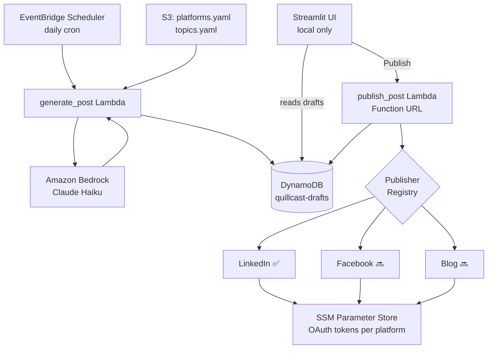

<div align="center">

# Quillcast

**Serverless AI content pipeline — discover trends, draft platform-adapted posts,  
preview & edit locally, publish with one click.**

[](LICENSE)
[](https://www.python.org/)
[](https://docs.aws.amazon.com/cdk/v2/guide/)
[](#cost)

</div>

---

Quillcast runs on AWS for pennies a month. Every day, a Lambda function picks a trending topic from your RSS feeds or curated list, calls Amazon Bedrock (Claude Haiku) to draft a platform-adapted post, and saves it to DynamoDB. You open a local Streamlit UI, see a pixel-accurate preview of how the post will look on LinkedIn, tweak the copy inline, and hit **Publish**.

No hosted UI. No always-on containers. No unnecessary cost.

> **Status:** Active development — Phase 1 (Foundation) complete. See [docs/PLAN.md](docs/PLAN.md) for the full roadmap.

---

## Table of Contents

- [Features](#features)
- [Architecture](#architecture)
- [Cost](#cost)
- [Prerequisites](#prerequisites)
- [Quick Start](#quick-start)
- [Configuration](#configuration)
- [Adding a New Platform](#adding-a-new-platform)
- [Project Structure](#project-structure)
- [Contributing](#contributing)
- [License](#license)

---

## Features

- **AI-generated drafts** — Claude Haiku generates platform-adapted content variants (LinkedIn, Facebook, blog) in a single Bedrock call
- **Human-in-the-loop** — mandatory local review before anything goes live; no post is ever published automatically
- **Pixel-accurate preview** — Streamlit UI renders a LinkedIn card mock-up so you see exactly how the post will look
- **Inline editing** — edit the draft directly in the UI with a live character counter and platform constraint warnings
- **Multi-platform ready** — publisher abstraction means adding Facebook or a blog platform requires one new file, zero core changes
- **Truly serverless** — EventBridge + Lambda + DynamoDB, all within AWS free tier at personal-use volume
- **Config-driven** — enable/disable platforms, add RSS feeds, update topics — all via YAML files in S3, no redeployment

---

## Architecture



### Flow

1. **EventBridge** triggers `generate_post` Lambda daily at your configured time
2. Lambda fetches trending articles from RSS feeds, merges with your `topics.yaml`, selects the best topic
3. A single Bedrock call generates content variants for all enabled platforms as structured JSON
4. The draft is written to DynamoDB with `OverallStatus: PENDING`
5. You open `streamlit run ui/app.py` locally — the UI queries the DynamoDB GSI for pending drafts
6. You preview, edit, and click **Publish** — the UI calls `publish_post` Lambda via its Function URL
7. Lambda loads OAuth tokens from SSM, calls the platform API, updates DynamoDB with the post ID

---

## Cost

All services stay within AWS free tier at personal-use volume (≈30 posts/month):

| Service | Usage | Monthly Cost |
|---|---|---|
| EventBridge Scheduler | 30 events | Free |
| Lambda (×2) | ~60 invocations | Free (1M/month free tier) |
| DynamoDB On-Demand | ~100 reads/writes | Free (25 GB free tier) |
| Bedrock — Claude Haiku | 30 posts × ~500 tokens | ~$0.01 |
| S3 | 2 small config files | ~$0 |
| SSM Parameter Store (Standard) | 3–5 parameters | Free |
| **Total** | | **~$0.01–0.05/month** |

Set an AWS Budget alert at $5/month as a safety net — instructions in [Quick Start](#quick-start).

---

## Prerequisites

- **AWS account** with CLI configured (`aws configure`)
- **Python 3.9+** and **Node.js 20+** (for CDK CLI)
- **LinkedIn Developer App** with `w_member_social` scope — [register here](https://developer.linkedin.com/)
- **Amazon Bedrock** — enable Claude Haiku model access in your AWS region via the [Bedrock console](https://console.aws.amazon.com/bedrock/)

---

## Quick Start

### 1. Clone and set up

```bash
git clone https://github.com/your-username/quillcast.git
cd quillcast

# Install CDK CLI
npm install -g aws-cdk

# Create virtual environment
python3 -m venv .venv && source .venv/bin/activate

# Install dependencies
pip install -r requirements-cdk.txt -r requirements-dev.txt
```

### 2. Configure your environment

```bash
cp .env.example .env
# Edit .env with your AWS account ID, region, and author details
```

### 3. Edit your voice and topics

Open `config/topics.yaml` and update:
- `author_name` — your name (used in the Streamlit preview)
- `voice.description` — how you actually write (be specific; this drives Bedrock's output)
- `evergreen_topics` — topics you'd genuinely post about

Open `config/platforms.yaml` to add or remove RSS feeds.

### 4. Deploy AWS infrastructure

```bash
# One-time bootstrap per AWS account + region
cdk bootstrap

# Deploy DynamoDB table, S3 bucket, and SSM parameters
cdk deploy QuillcastStorageStack
```

Note the `ConfigBucketName` from the deployment output, then upload your config:

```bash
aws s3 cp config/platforms.yaml s3://<ConfigBucketName>/config/platforms.yaml
aws s3 cp config/topics.yaml    s3://<ConfigBucketName>/config/topics.yaml
```

### 5. LinkedIn OAuth

```bash
export LINKEDIN_CLIENT_ID=your_client_id
export LINKEDIN_CLIENT_SECRET=your_client_secret
python scripts/linkedin_oauth.py
```

This opens a browser, handles the OAuth flow, and stores your tokens in SSM automatically.

> Add `http://localhost:8080/callback` as an authorized redirect URL in your LinkedIn app settings before running this.

### 6. Set a budget alert

In the [AWS Billing console](https://console.aws.amazon.com/billing/home#/budgets), create a budget alert at **$5/month**. This guards against any unexpected runaway costs.

### 7. Run the review UI

```bash
source .venv/bin/activate
streamlit run ui/app.py
```

---

## Configuration

### `config/platforms.yaml`

Controls which platforms are enabled and where their OAuth tokens live in SSM. Flip `enabled: true` to activate a platform — no code changes needed.

```yaml
platforms:
  linkedin:
    enabled: true
    ssm_token_key: /quillcast/linkedin/tokens

  facebook:
    enabled: false    # flip to enable
    ssm_token_key: /quillcast/facebook/tokens

rss_feeds:
  - url: https://hnrss.org/frontpage
    category: tech
```

### `config/topics.yaml`

Your author voice and fallback topics for days when RSS yields nothing relevant.

```yaml
voice:
  author_name: Your Name
  description: Direct, opinionated, practical. No filler phrases.
  target_audience: Software engineers and tech leads

evergreen_topics:
  - Lessons from shipping side projects
```

---

## Adding a New Platform

1. Create `publishers/<platform>.py` implementing the `Publisher` abstract base class
2. Set `enabled: true` in `config/platforms.yaml` with an `ssm_token_key`
3. Store your OAuth token JSON in SSM at that key path
4. Re-upload `platforms.yaml` to S3

The Streamlit UI will automatically show a new tab for the platform. No Lambda or UI code changes required.

See `publishers/base.py` for the full interface and `publishers/linkedin.py` as a reference implementation.

For full architecture details see [docs/design.md](docs/design.md).

---

## Project Structure

```
quillcast/
├── cdk/                        # AWS CDK infrastructure
│   ├── app.py
│   └── stacks/
│       ├── storage_stack.py    # DynamoDB + S3 + SSM (Phase 1)
│       ├── lambda_stack.py     # Lambdas + Function URL (Phase 2–3)
│       └── scheduler_stack.py  # EventBridge + DLQ (Phase 5)
│
├── lambdas/
│   ├── generate_post/          # Trend fetch → Bedrock → DynamoDB
│   └── publish_post/           # Publisher dispatch → platform API
│
├── publishers/
│   ├── base.py                 # Abstract Publisher interface
│   ├── registry.py             # Platform name → Publisher class
│   ├── linkedin.py             # LinkedIn REST API publisher
│   └── blog/                   # Blog publisher stubs
│
├── ui/
│   ├── app.py                  # Streamlit entrypoint (run locally)
│   └── components/             # Platform preview cards, tab layout
│
├── shared/
│   ├── models.py               # PostRecord, PostContent, PublishResult
│   ├── dynamodb.py             # DynamoDB helpers
│   └── config.py               # S3 config loader
│
├── config/
│   ├── platforms.yaml          # Platform enable/disable + RSS feeds
│   └── topics.yaml             # Author voice + evergreen topics
│
├── scripts/
│   ├── linkedin_oauth.py       # OAuth flow helper
│   ├── get_telegram_chat_id.py # Telegram setup helper
│   └── test_telegram.py        # Telegram notification test
│
├── docs/
│   ├── design.md               # Full architecture & data model
│   └── PLAN.md                 # Phased implementation plan
├── tests/
├── .env.example
├── pyproject.toml
├── requirements-cdk.txt
└── requirements-dev.txt
```

---

## Contributing

Contributions are welcome, especially new platform publishers. See [docs/PLAN.md](docs/PLAN.md) for what's planned and what's in progress.

1. Fork the repo and create a branch: `git checkout -b feat/facebook-publisher`
2. Make your changes and add tests
3. Run the linter: `ruff check .`
4. Run tests: `pytest`
5. Open a pull request with a clear description

Please do not commit `.env` files, tokens, or any real credentials. All secrets must go through SSM Parameter Store.

---

## License

[MIT](LICENSE) — free to use, modify, and distribute.

