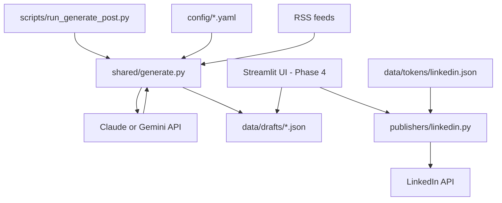

<div align="center">

# Quillcast

**Local AI content pipeline — discover trends, draft platform-adapted posts,  
preview & edit, publish with one click.**

[](LICENSE)
[](https://www.python.org/)

</div>

---

Quillcast runs entirely on your machine. It picks a topic from RSS feeds or your curated list, calls **Claude or Gemini** directly to draft posts, saves them as local JSON files, and (coming soon) lets you preview and publish to LinkedIn from a Streamlit UI.

No AWS. No Lambda. No Bedrock. No Marketplace billing.

> **Status:** Active development — Phase 2 (content generation) works locally. See [docs/PLAN.md](docs/PLAN.md).

**Setup guide:** [docs/SETUP.md](docs/SETUP.md)

---

## Table of Contents

- [Features](#features)
- [Architecture](#architecture)
- [Cost](#cost)
- [Prerequisites](#prerequisites)
- [Quick Start](#quick-start)
- [Configuration](#configuration)
- [Adding a New Platform](#adding-a-new-platform)
- [Project Structure](#project-structure)
- [Contributing](#contributing)
- [License](#license)

---

## Features

- **AI-generated drafts** — Claude or Gemini generates platform-adapted content variants (LinkedIn, Facebook, blog) in one API call
- **Human-in-the-loop** — mandatory local review before anything goes live; no post is ever published automatically
- **Pixel-accurate preview** — Streamlit UI renders a LinkedIn card mock-up (Phase 4)
- **Inline editing** — edit drafts locally with character counters and platform constraints
- **Multi-platform ready** — publisher abstraction means adding Facebook or a blog requires one new file
- **Config-driven** — enable/disable platforms, RSS feeds, and topics via YAML — no redeployment
- **Fully local** — config, drafts, and OAuth tokens stay on your machine

---

## Architecture



### Flow

1. You run `python scripts/run_generate_post.py` (or a future cron on your machine)
2. Quillcast fetches RSS articles, falls back to evergreen topics from `config/topics.yaml`
3. One LLM API call generates JSON content variants for all enabled platforms
4. The draft is saved to `data/drafts/<post-id>.json` with `OverallStatus: PENDING`
5. You open `streamlit run ui/app.py` — review, edit, and publish (Phase 3–4)
6. The LinkedIn publisher reads tokens from `data/tokens/linkedin.json` and posts on your approval

---

## Cost

| Item | Typical monthly cost |
|------|---------------------|
| Claude Haiku or Gemini Flash | ~$0.01–0.50 (≈30 posts) |
| LinkedIn API | Free |
| AWS | **$0** — not used |
| **Total** | **~$0.01–0.50/month** |

You pay Anthropic or Google directly. No cloud infrastructure bill.

---

## Prerequisites

- **Python 3.9+**
- **Anthropic or Google API key** for draft generation
- **LinkedIn Developer App** (Phase 3 publish) with `w_member_social` scope — [register here](https://developer.linkedin.com/)

---

## Quick Start

```bash
git clone https://github.com/your-username/quillcast.git
cd quillcast

python3 -m venv .venv && source .venv/bin/activate
pip install -r requirements.txt

cp .env.example .env
# Edit .env — keys are loaded automatically when you run scripts

python scripts/run_generate_post.py
ls data/drafts/
```

### Review & publish (UI)

```bash
pip install -r ui/requirements.txt
streamlit run ui/app.py
```

**Claude (default):** [console.anthropic.com](https://console.anthropic.com/)  
**Gemini:** set `LLM_PROVIDER=gemini` and `GEMINI_API_KEY` from [Google AI Studio](https://aistudio.google.com/apikey)

For LinkedIn OAuth and full setup, see **[docs/SETUP.md](docs/SETUP.md)**.

---

## Configuration

### `config/platforms.yaml`

Controls which platforms are enabled, where OAuth tokens are stored, and RSS feed sources.

```yaml
platforms:
  linkedin:
    enabled: true
    token_file: data/tokens/linkedin.json

rss_feeds:
  - url: https://hnrss.org/frontpage
    category: tech
```

### `config/topics.yaml`

Your author voice and fallback topics for days when RSS yields nothing relevant.

```yaml
voice:
  author_name: Your Name
  description: Direct, opinionated, practical. No filler phrases.
  target_audience: Software engineers and tech leads

evergreen_topics:
  - Lessons from shipping side projects
```

### Environment variables

| Variable | Required | Description |
|----------|----------|-------------|
| `ANTHROPIC_API_KEY` | For Claude | API key from Anthropic |
| `GEMINI_API_KEY` | For Gemini | API key from Google |
| `LLM_PROVIDER` | No | `claude` (default) or `gemini` |
| `LLM_MODEL` | No | Override default model |
| `LINKEDIN_CLIENT_ID` | For OAuth | LinkedIn app client ID |
| `LINKEDIN_CLIENT_SECRET` | For OAuth | LinkedIn app secret |

---

## Adding a New Platform

1. Create `publishers/<platform>.py` implementing the `Publisher` abstract base class
2. Set `enabled: true` in `config/platforms.yaml` with a `token_file` path
3. Run the platform's OAuth flow and save tokens to that file

The Streamlit UI will show a new tab for the platform automatically. See `docs/design.md` for the full interface.

---

## Project Structure

```
quillcast/
├── shared/
│   ├── generate.py             # RSS → topic → LLM → save draft
│   ├── llm.py                  # Claude / Gemini API client
│   ├── rss.py                  # RSS feed fetcher
│   ├── drafts.py               # Local JSON draft storage
│   ├── config.py               # YAML config loader
│   └── models.py               # PostRecord, PublishResult, etc.
│
├── publishers/                 # Platform API integrations (Phase 3)
├── ui/                         # Streamlit review UI (Phase 4)
│   ├── app.py
│   └── components/
│
├── config/
│   ├── platforms.yaml
│   └── topics.yaml
│
├── data/                       # gitignored — drafts + tokens
│   ├── drafts/
│   └── tokens/
│
├── scripts/
│   ├── run_generate_post.py
│   ├── publish_post.py
│   └── linkedin_oauth.py
│
├── docs/
│   ├── SETUP.md
│   ├── design.md
│   └── PLAN.md
│
├── tests/
├── .env.example
├── requirements.txt
└── requirements-dev.txt
```

---

## Contributing

Contributions welcome, especially new platform publishers. See [docs/PLAN.md](docs/PLAN.md).

1. Fork and branch: `git checkout -b feat/facebook-publisher`
2. Make changes and add tests
3. `ruff check .` and `pytest`
4. Open a pull request

Do not commit `.env`, `data/`, or any real credentials.

---

## License

[MIT](LICENSE)
