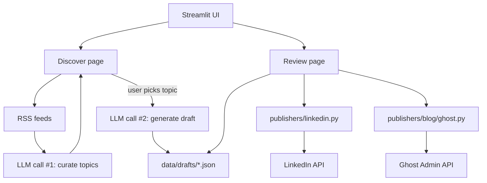

<div align="center">

# Quillcast

**Local AI content pipeline — discover trends, draft platform-adapted posts,  
preview & edit, publish with one click.**

[](LICENSE)
[](https://www.python.org/)

</div>

---

Quillcast runs entirely on your machine. It picks a topic from RSS feeds or your curated list, calls **Claude or Gemini** directly to draft posts, saves them as local JSON files, and lets you preview and publish to **LinkedIn** and **Ghost** from a Streamlit UI.

No AWS. No Lambda. No Bedrock. No Marketplace billing.

> **Status:** Feature-complete for v1 — discover, draft, review, and publish locally.

**Setup guide:** [docs/SETUP.md](docs/SETUP.md)

---

## Table of Contents

- [Features](#features)
- [Architecture](#architecture)
- [Cost](#cost)
- [Prerequisites](#prerequisites)
- [Quick Start](#quick-start)
- [Configuration](#configuration)
- [Adding a New Platform](#adding-a-new-platform)
- [Project Structure](#project-structure)
- [Contributing](#contributing)
- [License](#license)

---

## Features

- **AI-generated drafts** — Claude or Gemini generates platform-adapted content variants (LinkedIn, Facebook, blog) in one API call
- **Human-in-the-loop** — mandatory local review before anything goes live; no post is ever published automatically
- **Pixel-accurate preview** — Streamlit UI renders LinkedIn and blog previews
- **Ghost blog publish** — one-click create **drafts** in Ghost Admin (local or production)
- **Inline editing** — edit drafts locally with character counters and platform constraints
- **Multi-platform ready** — publisher abstraction means adding Facebook or a blog requires one new file
- **Config-driven** — enable/disable platforms, RSS feeds, and topics via YAML — no redeployment
- **Fully local** — config, drafts, and OAuth tokens stay on your machine

---

## Architecture


```mermaid
graph TD
    A[Streamlit UI] --> B[Discover page]
    B --> C[RSS feeds]
    C --> D[LLM call #1: curate topics]
    D --> B
    B -->|user picks topic| E[LLM call #2: generate draft]
    E --> F[data/drafts/*.json]

    A --> G[Review page]
    G --> F
    G --> H[publishers/linkedin.py]
    H --> I[LinkedIn API]
    G --> J[publishers/blog/ghost.py]
    J --> K[Ghost Admin API]
```

### Flow

1. Open **Discover** → fetch RSS → LLM curates today's topic cards
2. Pick a topic → **Generate draft** (second LLM call)
3. Switch to **Review** → edit, preview, **Publish** to LinkedIn and/or Ghost (blog drafts)
4. Optional CLI: `python scripts/run_generate_post.py` auto-picks a topic without the UI

---

## Cost

| Item | Typical monthly cost |
|------|---------------------|
| Claude Haiku or Gemini Flash | ~$0.01–0.50 (≈30 posts) |
| LinkedIn API | Free |
| Ghost Admin API | Free |
| AWS | **$0** — not used |
| **Total** | **~$0.01–0.50/month** |

You pay Anthropic or Google directly. No cloud infrastructure bill.

---

## Prerequisites

- **Python 3.9+**
- **Anthropic or Google API key** for draft generation
- **LinkedIn Developer App** with `w_member_social` scope — [register here](https://developer.linkedin.com/) (LinkedIn publish)
- **Ghost custom integration** — Admin API URL + key from Ghost Admin → Settings → Integrations (blog publish). See [docs/SETUP.md](docs/SETUP.md#6b-ghost-blog)

---

## Quick Start

```bash
git clone https://github.com/s-prateek/quillcast.git
cd quillcast

python3 -m venv .venv && source .venv/bin/activate
pip install -r requirements.txt

cp .env.example .env
# Edit .env — keys are loaded automatically when you run scripts

python scripts/run_generate_post.py
ls data/drafts/
```

### Review & publish (UI)

```bash
pip install -r ui/requirements.txt
streamlit run ui/app.py
```

1. **Discover** — fetch RSS, pick a curated topic, generate draft
2. **Review** — edit, preview, publish to LinkedIn and/or Ghost (blog tab)

**Ghost blog:** add `GHOST_URL` and `GHOST_ADMIN_API_KEY` to `.env`, then run `python scripts/ghost_setup.py` to validate. Publish creates a **draft in Ghost Admin**. See [docs/SETUP.md](docs/SETUP.md#6b-ghost-blog).

**Claude (default):** [console.anthropic.com](https://console.anthropic.com/)  
**Gemini:** set `LLM_PROVIDER=gemini` and `GEMINI_API_KEY` from [Google AI Studio](https://aistudio.google.com/apikey)

For LinkedIn OAuth, Ghost setup, and full walkthrough, see **[docs/SETUP.md](docs/SETUP.md)**.

---

## Configuration

Local config files are **gitignored** (like `.env`). Copy the minimal schema templates and customize:

```bash
cp config/personas.example.yaml config/personas.yaml
cp config/platforms.example.yaml config/platforms.yaml
```

| File | Purpose |
|------|---------|
| `platforms.yaml` | Enabled platforms, RSS feeds, categories, Ghost template maps |
| `personas.yaml` | Voice, personas (any ids), feed links, evergreen topics |

Full field reference, examples, and voice tips: **[docs/SETUP.md §3](docs/SETUP.md#3-edit-config-files)**.

`AUTHOR_NAME` in `.env` overrides `author_name` in LLM prompts.

### Environment variables

| Variable | Required | Description |
|----------|----------|-------------|
| `ANTHROPIC_API_KEY` | For Claude | API key from Anthropic |
| `GEMINI_API_KEY` | For Gemini | API key from Google |
| `LLM_PROVIDER` | No | `claude` (default) or `gemini` |
| `LLM_MODEL` | No | Override default model |
| `LINKEDIN_CLIENT_ID` | For OAuth | LinkedIn app client ID |
| `LINKEDIN_CLIENT_SECRET` | For OAuth | LinkedIn app secret |
| `GHOST_URL` | For blog | Ghost site URL (e.g. `http://localhost:2368`) |
| `GHOST_ADMIN_API_KEY` | For blog | Ghost Admin API key (`id:secret`) |

Credentials for LinkedIn live in **`data/tokens/`** (gitignored). Ghost credentials live in **`.env`** (gitignored). Use `scripts/linkedin_oauth.py` for LinkedIn; add Ghost vars to `.env` manually and run `scripts/ghost_setup.py` to validate.

---

## Adding a New Platform

1. Create `publishers/<platform>.py` implementing the `Publisher` abstract base class
2. Set `enabled: true` in `config/platforms.yaml` with a `token_file` path
3. Run the platform's OAuth flow and save tokens to that file

The Streamlit UI will show a new tab for the platform automatically. See `docs/design.md` for the full interface.

---

## Project Structure

```
quillcast/
├── shared/
│   ├── generate.py             # generate_post_for_topic()
│   ├── discover.py             # RSS → LLM topic curation
│   ├── publish.py              # publish/save/archive helpers
│   ├── blog_content.py         # blog title/body/tags JSON helpers
│   ├── llm.py                  # Claude / Gemini API client
│   ├── rss.py                  # RSS feed fetcher
│   ├── drafts.py               # Local JSON draft storage
│   ├── config.py               # YAML config loader
│   └── models.py               # PostRecord, PublishResult, etc.
│
├── publishers/                 # Platform API integrations
│   ├── linkedin.py
│   └── blog/ghost.py
├── ui/
│   ├── app.py                  # Discover + Review navigation
│   └── components/
│       ├── discover.py
│       ├── platform_tab.py
│       └── blog_tab.py
│
├── config/
│   ├── personas.example.yaml   # committed template
│   ├── personas.yaml           # local copy (gitignored)
│   ├── platforms.example.yaml  # committed template
│   └── platforms.yaml          # local copy (gitignored)
│
├── data/                       # gitignored — drafts + tokens
│   ├── drafts/
│   └── tokens/
│
├── scripts/
│   ├── run_generate_post.py
│   ├── publish_post.py
│   ├── linkedin_oauth.py
│   └── ghost_setup.py
│
├── docs/
│   ├── SETUP.md
│   └── design.md
│
├── tests/
├── CONTRIBUTING.md
├── .env.example
├── requirements.txt
└── requirements-dev.txt
```

---

## Contributing

See **[CONTRIBUTING.md](CONTRIBUTING.md)** for dev setup, tests, and how to add a new platform publisher.

---

## License

[MIT](LICENSE)
