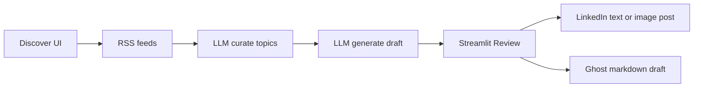
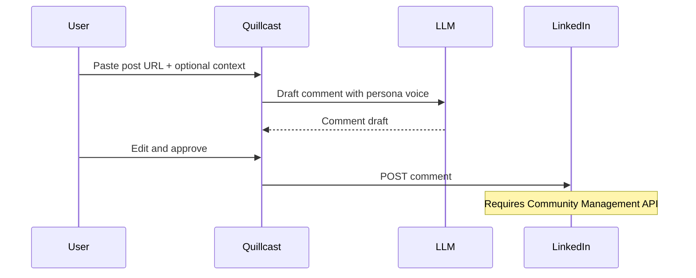
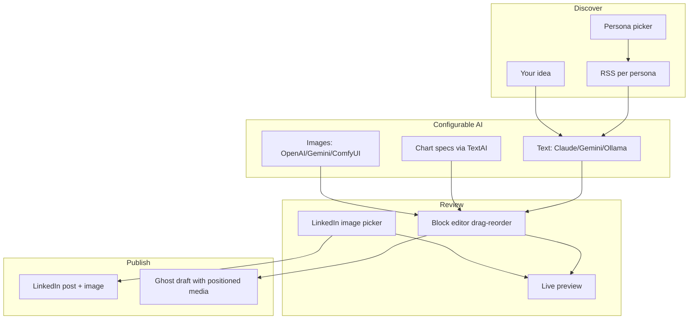

# Quillcast v2 — Complete Roadmap

> **Last updated:** 2026-07-08  
> **Status:** v1 feature-complete (discover → draft → review → publish). v2 in progress.

This document is the single source of truth for Quillcast evolution: persona/voice, media, AI providers, block editing, and LinkedIn engagement. Work proceeds phase by phase; do not skip foundational phases unless noted.

---

## Where we are today



| Capability | Status |
|------------|--------|
| RSS discovery + custom ideas | Done |
| Claude / Gemini draft generation | Done |
| LinkedIn + Ghost publish | Done |
| Single global voice | Replaced by `config/personas.yaml` (Phase 1) |
| Basic media upload + LinkedIn image post + Ghost feature image | **Partial** (Phase 2a) |
| Manual matplotlib charts | **Partial** — small, overwrites `chart.png` |
| Image positioning in blog body | Not started |
| Multi-persona (tech vs gaming) | Done (Phase 1) |
| Configurable local/cloud AI for images/charts | Not started |
| LinkedIn engagement / commenting | Documented only (Phase 6) |

---

## Recommended build order

| Order | Phase | Priority | Depends on |
|-------|-------|----------|------------|
| 1 | [Phase 3](#phase-3--ai-provider-layer) — AI provider layer | High | — |
| 2 | [Phase 4](#phase-4--block-editor--image-positioning) — Block editor | High | Phase 3 (chart AI) |
| 3 | [Phase 5](#phase-5--charts-v2-ai-generation) — Charts v2 | High | Phase 3, 4 |
| 4 | [Phase 1](#phase-1--multi-persona--authentic-voice) — Persona + voice | High | Phase 3 (shared AI layer) |
| 5 | [Phase 6](#phase-6--ai-image-generation--linkedin-rich-media) — AI images | Medium | Phase 3, 4 |
| 6 | [Phase 2](#phase-2--basic-media-enrichment) — Finish remaining 2.x tasks | Low | Mostly done |
| 7 | [Phase 7](#phase-7--linkedin-engagement-spec-only) — Engagement doc | Deferred | — |

**Note:** Phase 1 (persona) was originally first in the v2 plan. Phase 3 (AI providers) is now recommended first because chart/image AI and voice improvements all route through the same provider layer. Persona config plugs into that layer in Phase 1.

---

## Phase 1 — Multi-persona + authentic voice

**Goal:** Switch between personas (e.g. **Tech/Practitioner** vs **Gaming/Design**) that drive voice, RSS sources, and blog defaults. Posts should sound like you, not generic AI.

### Tasks

- [x] **1.1** Add `config/personas.yaml` with `tech` and `gaming` personas (voice, `avoid_phrases`, `voice_examples`, evergreen topics, blog default tags)
- [x] **1.2** Extend `config/platforms.yaml` RSS with named feed keys (`hn`, `techcrunch`, `theverge`, `rps`, `ign`, `steam`)
- [x] **1.3** Extend `shared/config.py`: `load_personas_config()`, `get_persona(id)`, `rss_feeds_for_persona(persona)`
- [x] **1.4** Add `PersonaID: str` to `PostRecord` in `shared/models.py` (default `"tech"` for existing drafts)
- [x] **1.5** Thread persona through `shared/discover.py`, `shared/rss.py`, `shared/generate.py` — filter feeds and pass voice per persona
- [x] **1.6** Overhaul prompts in `shared/llm.py` (or `shared/ai/` after Phase 3):
  - Inject `avoid_phrases` ban list
  - Few-shot `voice_examples` per persona
  - Structure variety (not always 3 identical paragraphs)
  - Blog schema: optional `pull_quote` field
  - Persona-aware topic curation
- [x] **1.7** Add **"More personality"** regenerate button in Review (re-draft same topic with stronger voice modifier)
- [x] **1.8** UI: persona `selectbox` in Discover (`ui/components/discover.py`); persona badge on draft list (`ui/app.py`)
- [x] **1.9** Optional: persist last persona in `data/preferences.json`
- [x] **1.10** Tests: persona prompt injection in `tests/test_llm.py`

### Key files

`config/personas.yaml`, `config/platforms.yaml`, `shared/config.py`, `shared/models.py`, `shared/discover.py`, `shared/generate.py`, `shared/rss.py`, `shared/llm.py`, `ui/components/discover.py`, `ui/app.py`

### Success criteria

- Gaming persona post → news reaction or "what I'm playing" take, `Games` + `Nintendo` tags, community tone (not design analysis)
- AI/engineering post under `tech` → practitioner voice, no banned phrases
- Drafts store `PersonaID`; Discover shows persona-appropriate RSS topics

---

## Phase 2 — Basic media enrichment

**Goal:** Posts with visual hooks — upload images, attach to LinkedIn/Ghost. Human-in-the-loop.

> **Shipped (2026-07):** Core upload path exists. Remaining tasks are polish and will be superseded by Phases 4–6 for positioning and AI.

### Tasks

- [x] **2.1** Local asset storage: `shared/assets.py`, `data/assets/<PostID>/`
- [x] **2.2** Media metadata on drafts: `PostRecord.Media`, `shared/media.py`
- [x] **2.3** Wire `PostContent.media_urls` through `shared/publish.py`
- [x] **2.4** LinkedIn image upload + attach (`publishers/linkedin.py` — `initializeUpload` → PUT → post)
- [x] **2.5** Ghost image upload + `feature_image` (`publishers/blog/ghost.py`)
- [x] **2.6** Shared Media section in Review UI (`ui/components/media_panel.py`, `ui/app.py`)
- [x] **2.7** Basic matplotlib chart render (`shared/charts.py`)
- [x] **2.8** Fix Streamlit duplicate widget keys (shared media section above tabs)
- [ ] **2.9** Deprecate `Media.blog.inline[]` append-at-end flow once Phase 4 block editor ships
- [ ] **2.10** Remove manual JSON chart textarea from media panel once Phase 5 AI charts ship

### Known limitations (addressed in later phases)

- Images not positionable in article body
- Charts overwrite `chart.png`, render too small
- No AI for chart specs or images
- Inline images appended at end on Ghost publish

### Success criteria (Phase 2 baseline — met)

- [x] Upload image → publish to LinkedIn as image post
- [x] Upload image → publish to Ghost with feature image

---

## Phase 3 — AI provider layer

**Goal:** One config to choose **local vs cloud** per capability: text, chart specs, images, video (stub).

### Tasks

- [ ] **3.1** Add `config/ai.yaml`:

```yaml
text:
  provider: claude        # claude | gemini | ollama
  model: claude-3-5-haiku-latest
  # ollama_base_url: http://localhost:11434

image:
  provider: none          # none | openai | gemini | comfyui
  model: dall-e-3
  # comfyui_url: http://localhost:8188

chart:
  provider: inherit       # uses text provider

video:
  provider: none          # stub for future
```

- [ ] **3.2** Create `shared/ai/` package:
  - `registry.py` — load config, return provider instances
  - `text/base.py` — `complete(system, user) -> str`
  - `text/claude.py`, `text/gemini.py`, `text/ollama.py`
  - `image/base.py` — `generate(prompt, size) -> bytes`
  - `image/openai.py`, `image/gemini.py`, `image/comfyui.py` (stubs OK initially)
  - `chart.py` — `suggest_chart_specs(context) -> list[dict]` via text provider
- [ ] **3.3** Refactor `shared/llm.py` to thin wrapper over `shared/ai` registry (draft generation unchanged externally)
- [ ] **3.4** Extend `.env.example`: `OLLAMA_BASE_URL`, `OPENAI_API_KEY`, document ComfyUI setup
- [ ] **3.5** Add `load_ai_config()` to `shared/config.py`
- [ ] **3.6** Tests: `tests/test_ai_providers.py` — mock each provider, registry resolution

### Provider notes

| Capability | Local option | Cloud option |
|------------|--------------|--------------|
| Text / chart specs | Ollama (`POST /api/chat`) | Claude, Gemini |
| Images | ComfyUI HTTP API | OpenAI DALL-E, Gemini Imagen |
| Video | Not in v2 | Stub only |

Ollama is suitable for text and chart JSON; it is **not** a practical image backend. Document this in `config/ai.yaml` comments.

### Success criteria

- Switch `text.provider` to `ollama` → draft generation works with local model
- Switch `text.provider` to `claude` → unchanged behavior from today
- Image provider `none` → no errors; upload-only flow still works

---

## Phase 4 — Block editor + image positioning

**Goal:** Images and charts live **inside** the article at positions you control. Drag to reorder.

### Tasks

- [ ] **4.1** Define block content model in `shared/blog_blocks.py`:

```json
{
  "title": "...",
  "tags": ["AI"],
  "body": "legacy markdown fallback",
  "blocks": [
    {"id": "b1", "type": "text", "markdown": "..."},
    {"id": "b2", "type": "pull_quote", "text": "..."},
    {"id": "b3", "type": "image", "filename": "hk-map.png", "alt": "...", "caption": "...", "width": "full"},
    {"id": "b4", "type": "chart", "filename": "chart-a1b2.png", "spec": {}, "caption": "..."}
  ]
}
```

- [ ] **4.2** Add `shared/blog_render.py` — blocks → markdown and HTML (preview + Ghost)
- [ ] **4.3** Migrate legacy `body`-only drafts → single `text` block on first open
- [ ] **4.4** Migrate `Media.blog.inline[]` → image blocks at end of article (one-time)
- [ ] **4.5** Build `ui/components/block_editor.py` with **`streamlit-dnd`** (add to `ui/requirements.txt`)
  - Drag-reorder keyed block containers
  - Toolbar: `+ Text`, `+ Image`, `+ Chart`, `+ Pull quote`
  - Per-block editors (text area, image thumb + alt/caption/width, chart preview + caption)
- [ ] **4.6** Replace plain `st.text_area` body in `ui/components/blog_tab.py` with block editor
- [ ] **4.7** Collapsible "Raw markdown" view for power users
- [ ] **4.8** Update `publishers/blog/ghost.py` — render HTML from ordered blocks; upload assets inline at correct positions (not append-at-end)
- [ ] **4.9** Update `GhostPublisher.render_preview()` — full-width images from blocks
- [ ] **4.10** Slim `shared/media.py` to LinkedIn attachment + optional blog `feature_image` hero only
- [ ] **4.11** Tests: `tests/test_blog_blocks.py`, `tests/test_blog_render.py`

### LinkedIn note

LinkedIn API supports **one attached image** per post — no inline positioning in the post body. Rich LinkedIn media is handled in Phase 6.

### Success criteria

- Drag chart block between two text blocks → preview and Ghost publish show chart in that position
- Existing markdown-only drafts open without data loss

---

## Phase 5 — Charts v2 + AI generation

**Goal:** Readable charts, multiple per post, AI-suggested from article context.

### Tasks

- [ ] **5.1** Fix `shared/charts.py` rendering:
  - `figsize=(12, 7)`, `dpi=200`
  - Fonts: title 16pt, labels 12pt, ticks 11pt
  - Unique filenames: `chart-{uuid8}.png` (never overwrite)
  - Optional `y_label`, `color`, `caption` in spec
- [ ] **5.2** Implement `shared/ai/chart.py` — send post title + nearby blocks to text provider; return 0–3 chart specs as JSON
- [ ] **5.3** Block editor: **"Suggest charts from post"** — user picks which specs to render
- [ ] **5.4** Per chart block: **"Regenerate with AI"** — new spec + new PNG file, updates block only
- [ ] **5.5** Remove static JSON chart textarea from `ui/components/media_panel.py`
- [ ] **5.6** Chart `caption` rendered below image in block HTML
- [ ] **5.7** Tests: chart render size/output, AI spec parsing mocks

### Success criteria

- Two charts in one post — unique files, readable at normal zoom without squinting
- AI-suggested chart matches article topic (e.g. deploy frequency for a CI/CD post)
- Regenerate on one block does not affect other charts

---

## Phase 6 — AI image generation + LinkedIn rich media

**Goal:** Generate images via configurable providers; improved LinkedIn media UX.

### Tasks

#### AI image generation

- [ ] **6.1** Implement image providers in `shared/ai/image/`:
  - `openai.py` — DALL-E (`OPENAI_API_KEY`)
  - `gemini.py` — Imagen if available on key
  - `comfyui.py` — local ComfyUI workflow HTTP API
- [ ] **6.2** Flow: text provider drafts image prompt from post context → user edits → image provider generates → `save_upload(post_id, f"ai-{uuid8}.png", bytes)`
- [ ] **6.3** Block editor: **"Generate image"** on image blocks — insert at block position
- [ ] **6.4** Video: `VideoProvider` protocol + `video.provider: none` in config — **not implemented**; document extension point

#### LinkedIn rich media (within API limits)

- [ ] **6.5** Full-width preview of selected LinkedIn image (not 120px thumbnail)
- [ ] **6.6** **"AI suggest image"** — prompt + generate, user picks variant
- [ ] **6.7** **"Use asset from library"** — quick-pick any uploaded/chart image
- [ ] **6.8** Alt text auto-suggested by text provider
- [ ] **6.9** UI copy: LinkedIn supports one image; positioning N/A

### Success criteria

- `image.provider: openai` → generate image inserted into blog block
- `image.provider: comfyui` → generate via local ComfyUI
- `image.provider: none` → upload-only, no errors
- LinkedIn tab: full-size preview before publish

---

## Phase 7 — LinkedIn engagement (spec only)

**Goal:** Document a realistic engagement workflow for future implementation. **No code in this phase.**

### Tasks

- [ ] **7.1** Write `docs/LINKEDIN_ENGAGEMENT.md` covering:

#### What LinkedIn's API cannot do

- No personalized feed or "top posts from connections"
- Deprecated Activity Feed API — no new access
- `r_member_social` — closed to new apps
- Scraping/automation — ToS violation

#### Realistic feature: Comment Assistant



- Prerequisites: Community Management API approval, `w_member_social_feed` OAuth scope, post URN extraction
- Proposed `CommentDraft` data model
- Optional bookmark queue (user pastes posts while browsing — no feed API needed)

- [ ] **7.2** Cross-link from `README.md` to engagement doc

### Success criteria

- Doc exists; picking up engagement work later requires no re-research

---

## Out of scope (all phases)

- Automated LinkedIn feed scraping or ranking
- Auto-publishing comments without human review
- Video generation/publish (stub config only)
- Auto-screenshot of URLs (Playwright — fragile)
- Facebook publisher (stub exists, unregistered)
- AWS/Lambda legacy path (`lambdas/`, `cdk/`)

---

## File map by phase

| Phase | Primary files |
|-------|---------------|
| 1 | `config/personas.yaml`, `config/platforms.yaml`, `shared/config.py`, `shared/models.py`, `shared/discover.py`, `shared/generate.py`, `shared/rss.py`, `shared/llm.py`, `ui/components/discover.py`, `ui/app.py` |
| 2 | `shared/assets.py`, `shared/media.py`, `shared/charts.py`, `shared/publish.py`, `publishers/linkedin.py`, `publishers/blog/ghost.py`, `ui/components/media_panel.py` |
| 3 | `config/ai.yaml`, `shared/ai/**`, `shared/llm.py`, `shared/config.py`, `.env.example` |
| 4 | `shared/blog_blocks.py`, `shared/blog_render.py`, `ui/components/block_editor.py`, `ui/components/blog_tab.py`, `publishers/blog/ghost.py`, `shared/blog_content.py` |
| 5 | `shared/charts.py`, `shared/ai/chart.py`, `ui/components/block_editor.py` |
| 6 | `shared/ai/image/**`, `ui/components/media_panel.py`, `ui/components/block_editor.py` |
| 7 | `docs/LINKEDIN_ENGAGEMENT.md` |

---

## End-state vision



When all phases are complete:

- **Persona** drives discovery, voice, and tags (tech vs gaming)
- **AI providers** are swappable per capability (local Ollama for text/charts, ComfyUI or cloud for images)
- **Block editor** controls where images and charts appear in blog posts
- **LinkedIn** gets AI-assisted single-image posts with full preview
- **Engagement** has a documented path for a future Comment Assistant

---

## Task checklist (quick reference)

| ID | Task | Phase | Status |
|----|------|-------|--------|
| 1.1 | `config/personas.yaml` | 1 | Done |
| 1.2 | Gaming RSS feeds in `platforms.yaml` | 1 | Done |
| 1.3 | Persona config loaders | 1 | Done |
| 1.4 | `PersonaID` on `PostRecord` | 1 | Done |
| 1.5 | Persona in discover/generate/rss | 1 | Done |
| 1.6 | Anti-AI prompt overhaul | 1 | Done |
| 1.7 | "More personality" regenerate | 1 | Done |
| 1.8 | Persona UI in Discover/Review | 1 | Done |
| 1.9 | Persist last persona | 1 | Done |
| 1.10 | Persona prompt tests | 1 | Done |
| 2.1 | Asset storage | 2 | Done |
| 2.2 | Media metadata on drafts | 2 | Done |
| 2.3 | `media_urls` in publish | 2 | Done |
| 2.4 | LinkedIn image upload | 2 | Done |
| 2.5 | Ghost feature image | 2 | Done |
| 2.6 | Review media UI | 2 | Done |
| 2.7 | Basic matplotlib charts | 2 | Done |
| 2.8 | Fix duplicate Streamlit keys | 2 | Done |
| 2.9 | Deprecate inline append flow | 2 | Pending |
| 2.10 | Remove manual chart JSON UI | 2 | Pending |
| 3.1 | `config/ai.yaml` | 3 | Pending |
| 3.2 | `shared/ai/` package | 3 | Pending |
| 3.3 | Refactor `llm.py` | 3 | Pending |
| 3.4 | `.env.example` updates | 3 | Pending |
| 3.5 | `load_ai_config()` | 3 | Pending |
| 3.6 | AI provider tests | 3 | Pending |
| 4.1 | Block content model | 4 | Pending |
| 4.2 | `blog_render.py` | 4 | Pending |
| 4.3 | Legacy body migration | 4 | Pending |
| 4.4 | Inline media migration | 4 | Pending |
| 4.5 | Block editor + streamlit-dnd | 4 | Pending |
| 4.6 | Replace blog text area | 4 | Pending |
| 4.7 | Raw markdown view | 4 | Pending |
| 4.8 | Ghost block publish | 4 | Pending |
| 4.9 | Block-aware preview | 4 | Pending |
| 4.10 | Slim `media.py` | 4 | Pending |
| 4.11 | Block editor tests | 4 | Pending |
| 5.1 | Chart render quality fix | 5 | Pending |
| 5.2 | `shared/ai/chart.py` | 5 | Pending |
| 5.3 | Suggest charts from post | 5 | Pending |
| 5.4 | Per-block regenerate | 5 | Pending |
| 5.5 | Remove chart JSON textarea | 5 | Pending |
| 5.6 | Chart captions in HTML | 5 | Pending |
| 5.7 | Chart tests | 5 | Pending |
| 6.1 | Image provider implementations | 6 | Pending |
| 6.2 | Generate image flow | 6 | Pending |
| 6.3 | Generate in block editor | 6 | Pending |
| 6.4 | Video stub | 6 | Pending |
| 6.5 | LinkedIn full-width preview | 6 | Pending |
| 6.6 | LinkedIn AI suggest image | 6 | Pending |
| 6.7 | LinkedIn asset picker | 6 | Pending |
| 6.8 | LinkedIn alt text AI | 6 | Pending |
| 6.9 | LinkedIn positioning copy | 6 | Pending |
| 7.1 | `LINKEDIN_ENGAGEMENT.md` | 7 | Pending |
| 7.2 | README cross-link | 7 | Pending |
